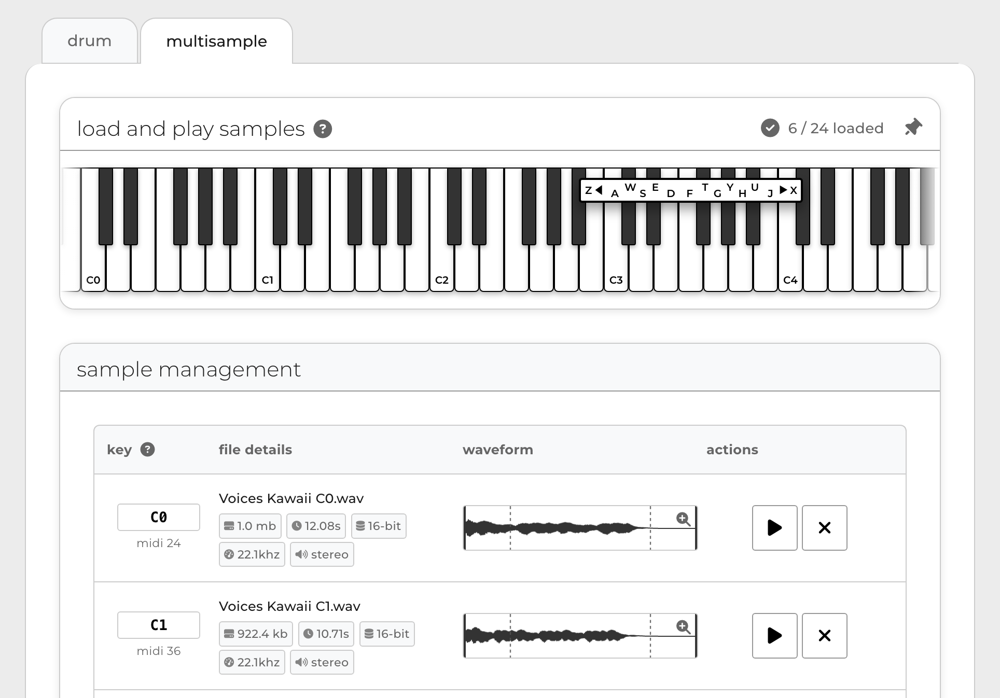

# OP-PatchStudio

**free & open source preset creator for op synthesizers. upload samples, edit waveforms, adjust settings and generate patches instantly.**




- **live demo:** [OP-PatchStudio](https://op-patch.studio/)
- **github:** [github.com/joseph-holland/op-patchstudio](https://github.com/joseph-holland/op-patchstudio)

## features

- **comprehensive preset generation** for op synthesizers (currently op-xy, more devices coming soon)
- **modern, responsive ui** built with react, typescript, and carbon design system  
- **drag-and-drop sample assignment** for drum and multisample presets
- **advanced waveform editing** with interactive zoom modal and marker adjustment
- **snap-to-zero-crossing** functionality for clean sample trimming
- **real-time audio processing** with sample rate conversion (44/22/11khz) and format optimization
- **accessibility-compliant interface** with wcag aa touch targets and keyboard navigation
- **live patch size monitoring** with optimization recommendations
- **advanced preset settings** including envelopes, tuning, velocity sensitivity, and modulation

## development setup

this project has been migrated to react with typescript for improved maintainability and modularity.

### requirements

- node.js 18+ 
- npm or yarn

### installation

```bash
# clone the repository
git clone https://github.com/joseph-holland/op-patchstudio.git
cd op-patchstudio

# install dependencies
npm install

# start development server
npm run dev

# build for production
npm run build

# run tests
npm run test
```

### project structure

```
/src
  /components         # react ui components (carbon-based, op-xy themed)
    /common          # shared components
    /drum           # drum-specific components
    /multisample    # multisample-specific components
  /hooks              # custom hooks for state, file i/o, audio, etc.
  /utils              # pure js/ts logic: audio, patch, file mgmt
  /theme              # custom carbon theme and style overrides
  /context            # app/global context providers
  app.tsx
  main.tsx
```

## usage

1. **open** the [OP-PatchStudio web app](https://op-patch.studio/) in your browser
2. select either the **drum** or **multisample** tab.
3. drag and drop your samples, or use the browse button to select files.
4. assign notes (for multisample), adjust settings and use the advanced dialog for detailed control.
5. optionally, use **import settings** to load engine-level settings from existing preset files.
6. click **generate patch** to download your preset as a zip file.
7. unzip and copy the folder to your op-xy's `presets` directory via usb.

## progressive web app (pwa)

OP-PatchStudio is available as a progressive web app for offline use and quick access.

### install for offline use

- **desktop**: look for the install icon in your browser's address bar or menu
- **mobile**: use your browser's "add to home screen" option
- **automatic prompt**: the app will show an install prompt when available

### pwa features

- **offline functionality**: core features work without internet connection
- **home screen access**: launch directly from your device's home screen
- **app shortcuts**: quick access to drum and multisample tools
- **automatic updates**: app updates automatically when online
- **native app experience**: runs like a native app with full-screen mode

### offline capabilities

- ✅ create and edit drum presets
- ✅ create and edit multisample presets  
- ✅ waveform editing and sample processing
- ✅ generate and download patch files
- ⚠️ sample upload requires internet connection
- ⚠️ some advanced features may require online access


see [migration_completion_summary.md](migration_completion_summary.md) for detailed progress report.

## credits

- joseph holland
- inspired by the awesome [opxy-drum-tool](https://buba447.github.io/opxy-drum-tool/) by brandon withrow (zeitgeese)

OP-PatchStudio is an unofficial tool not affiliated with or endorsed by teenage engineering.
this software is provided "as is" without warranty of any kind. use at your own risk. for educational and personal use only.
op-xy, op-1 and op-z are registered trademarks of teenage engineering.

